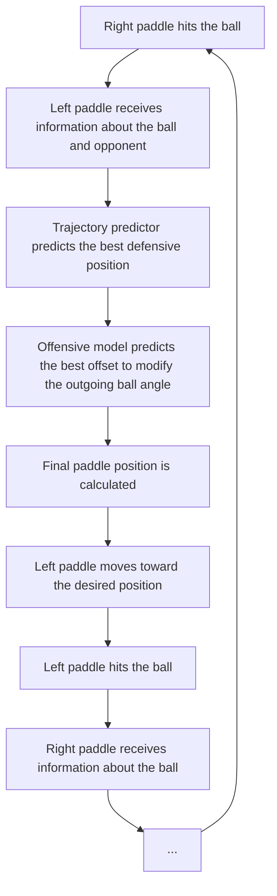
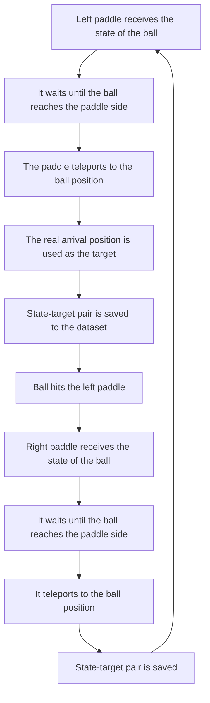
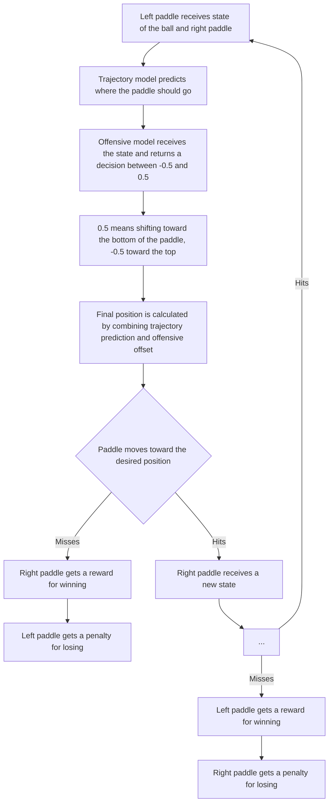

## Pong ML

This is my first bigger ML project. I created it because I had already written the Pong environment before, so I thought it would be a good idea to focus mainly on the ML part.

The model is basically a connection of two models - one that predicts the best position to defend and another one that tries to attack in the best way possible.

## Features

- Player vs Model - you can play against the model yourself and check if you can defeat it.
- Trajectory Predictor - the model receives data needed to predict where the ball will reach the paddle and where it should position itself to return the ball.
- Attacking/Offensive Model - it receives data about the ball and the opponent, which allows it to adjust the paddle position and return the ball at an inconvenient angle for the opponent.
- Learning modules - located in the `training` folder, which contains two Python files:
  - `supervised_learning_data_gen.py` - made for generating data later used to train the trajectory predictor on larger datasets.
  - `policy_model.py` - made for training the attacking abilities using policy-gradient learning during gameplay.

## How model works

Because my environment is deterministic, the model only needs to predict the best position once for every incoming trajectory - when the opponent hits the ball.



## How training works
Training works differently for these two models:
- Trajectory Predictor learns on larger datasets using supervised learning. Best outcomes are generated first and later used as training targets. These outcomes do not really change because the goal is simply to reach the incoming ball.
- Attacking/Offensive Model learns using policy-gradient updates from fresh interactions, which gives the model space to develop its own winning strategies.

## Trajectory Predictor learning
Generating examples:

Learning itself is just:
forward pass -> loss -> backward pass -> weight adjustment

Attacking Model
The attacking model works differently:


Here the learning process also works differently - there is no fixed desired value because the correct action depends on the reward, so the model needs some randomness for exploration:

- The model outputs `mu`, which represents its preferred action.
- A real action is sampled from a Gaussian distribution centered around `mu`, so values close to the model output are more likely while larger deviations are still possible.
- During training, the reward determines whether the sampled action should become more or less probable.
- The policy gradient is calculated using the difference between the sampled action and the model output together with the received reward.
- After that, the backpropagation process works almost the same as in the supervised model, only with different derivatives at the beginning.

## Project structure

The project contains two main folders and two main Python files:

- `models` folder - contains `.npz` files with model weights and `.npy` files containing training data. Initially, they contain weights trained by me. They are not perfect, but they are good enough for the current version of the project.
- `training` folder - contains two environments used for generating data for the Trajectory Predictor and training the Offensive Model.
- `model.py` - contains both models together with all prediction and training functions. If you want to reset the models or data, the reset functions are also located here.
- `pong_player_model.py` - here you can test the model yourself and see if you can defeat it.

## Notes / Limitations

- The models are implemented using only NumPy without any ML frameworks, so the implementation is not highly optimized. However, this does not noticeably affect gameplay.
- It is not guaranteed that the Offensive Model will develop surprising tactics. During my training it did not discover anything especially unusual, but it still learned to play reasonably well.
- The weights stored in `models/predictor_weights.npz` were trained on around 35k examples. The model can still be defeated, but it is difficult to beat consistently.
- The Trajectory Predictor assumes deterministic ball trajectories. If randomness is introduced into the ball movement after a hit, its predictions may become inaccurate.

## Running

If you want to play against the model:

```bash
python pong_player_model.py
```

If you want to train the model yourself:

- If you want to clear the weights or data, use the reset functions in `model.py`.
- Run:

```bash
python training/supervised_learning_data_gen.py
```

to generate data for the Trajectory Predictor, then train it using the learning functions in `model.py`.

- Run:

```bash
python training/policy_model.py
```

to train the Offensive Model.

## Requirements

- Python
- Pygame
- NumPy

```bash
pip install -r requirements.txt
```


